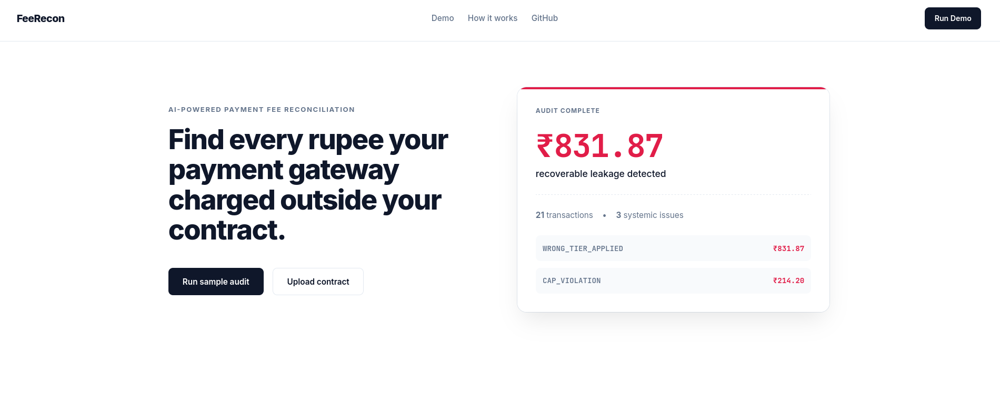
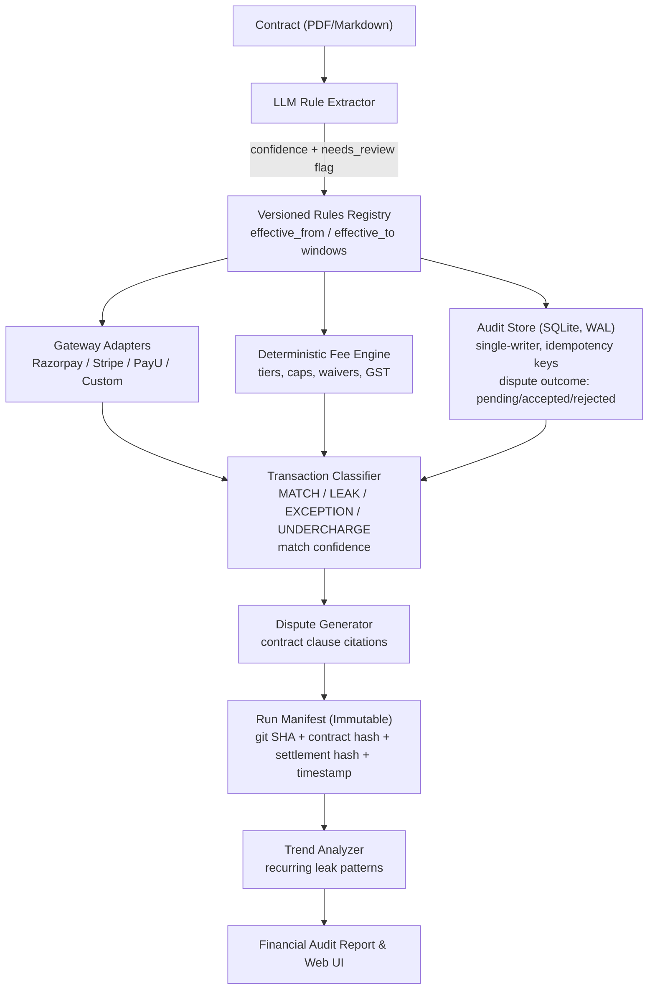

# Razorpay Fee Leakage Detector

Reconciles gateway settlement data against a merchant's actual pricing contract and flags where the gateway charged more (or less) than the contract allows.

---



## a. Problem Statement

Merchants negotiate custom pricing with payment gateways (Razorpay, Stripe, PayU) tiered volume discounts, zero-MDR instruments like UPI, capped fees on Netbanking, conditional refund waivers, GST on top. The contract sits in a PDF. Settlement data arrives as thousands of CSV rows. Nobody actually checks the CSV against the PDF at scale, so gateways routinely apply the wrong tier or skip a waiver, and 0.5–2.5% of processed value leaks out unnoticed.

## b. Existing Solutions

| Approach | Limitation |
|---|---|
| Manual spreadsheet reconciliation | Doesn't scale past a few hundred transactions/month |
| Gateway settlement dashboards | Show what was charged, not what the contract actually owes |
| Generic anomaly detection | Flags statistical outliers, not contract-rule violations no clause to point to in a dispute |
| Prompting an LLM to "read the contract and check the CSV" | Puts arithmetic inside the model, so totals aren't reproducible |

## c. Our Solution

The LLM extracts contract rules into JSON. The fee engine then uses those rules to calculate the expected charge for every transaction. No LLM call happens during reconciliation.

### c.1 Extraction Schema

The extractor has to emit one fixed JSON structure not a summary, not prose. `engine.py` reads it directly:

```json
{
  "payment_methods": {
    "DOMESTIC_CARD": {
      "type": "tiered_volume",
      "tiers": [
        {"min_volume": 0.0,       "max_volume": 1000000.0, "rate_pct": 2.0,  "confidence": 0.97, "source_span": "p.2, cl.3.1(a)"},
        {"min_volume": 1000000.0, "max_volume": 5000000.0, "rate_pct": 1.75, "confidence": 0.95, "source_span": "p.2, cl.3.1(b)"},
        {"min_volume": 5000000.0, "max_volume": null,      "rate_pct": 1.5,  "confidence": 0.93, "source_span": "p.2, cl.3.1(c)"}
      ],
      "status": "verified"
    },
    "NETBANKING": {
      "type": "flat_with_cap",
      "rate_pct": 1.0,
      "fee_cap": 20.0,
      "confidence": 0.98,
      "source_span": "p.3, cl.3.4",
      "status": "verified"
    }
  },
  "refund_policy": {
    "waiver_window_hours": 24.0,
    "waived_fee": 0.0,
    "confidence": 0.91,
    "source_span": "p.4, cl.4.2",
    "status": "verified",
    "needs_review": false
  }
}
```

Every value is a float, so nothing needs re-parsing before arithmetic. Each node carries `confidence` and `source_span` for the dispute draft, plus `status` / `needs_review` from a 3-pass self-consistency check if the extractor disagrees with itself across passes, the rule gets flagged instead of trusted.

```python
pm_rule = payment_methods["DOMESTIC_CARD"]
for tier in pm_rule["tiers"]:
    if tier["min_volume"] <= volume <= (tier["max_volume"] or float("inf")):
        rate = tier["rate_pct"]
        break

if pm_rule["type"] == "flat_with_cap":
    base_fee = min(amount * pm_rule["rate_pct"] / 100, pm_rule["fee_cap"])

if refund_hours <= refund_policy["waiver_window_hours"]:
    refund_fee = refund_policy["waived_fee"]
```

### c.2 Components

- **LLM Rule Extractor** contract text → the schema above.
- **Rules Registry** stores rules with an `effective_from` / `effective_to` window per version, so a transaction is priced against the rule that was live on its own booking date, not just the latest one.
- **Gateway Adapters** normalize Razorpay/Stripe/PayU contract and settlement formats into one schema.
- **Fee Engine** recomputes expected fees from the registry in parallel batches.
- **Audit Store** SQLite, WAL mode, single writer thread. Tracks idempotency keys and a per-dispute `outcome` (`pending` / `accepted` / `rejected`).
- **Transaction Classifier** labels each row `MATCH / LEAK / EXCEPTION / UNDERCHARGE`, with a confidence score on the *match* between settlement row and contract line (not on the fee math, which has no uncertainty of its own).
- **Dispute Generator** drafts a claim per leak, citing the clause and the expected vs. charged amount.
- **Run Manifest** git SHA, contract hash, settlement file hash, timestamp, per run.
- **Trend Analyzer** surfaces the same leak type recurring across runs.

## d. Pipeline



## e. Performance

<!-- Fill in after the benchmark run against data/ground_truth.json -->

| Metric | Result |
|---|---|
| Precision |  |
| Recall |  |
| F1-Score |  |
| Precision@K |  |
| Recall@K |  |
| Exception rate |  |
| Recovery rate |  |
| Escalation adherence rate |  |
| Citation accuracy |  |
| % actions within stopping-rule bounds |  |
| Kill-switch trigger rate |  |
| Manifest completeness |  |
| Throughput (txns/sec) |  |

## f. Design Choices

**Multi-pass extraction, not single-pass.** A single hallucinated tier silently corrupts every downstream number, so extraction runs 3 passes and diffs them field-by-field. Costs a bit of latency, catches disagreement before it reaches the registry.

**SQLite (WAL, single writer), not Postgres.** Fee calculation runs in parallel; audit writes are serialized through one writer to avoid SQLite's file-lock contention. For a larger deployment this would move to Postgres it's a driver swap, not a schema change.

**Rules are effective-dated, not "latest wins."** Contract amendments usually aren't retroactive. A transaction booked before a rate change has to be priced against the old rate, so each rule version carries its own validity window keyed to the transaction's booking date.

**Match confidence, not fee confidence.** The fee math is deterministic there's no genuine uncertainty in it. The actual uncertainty is in linking a settlement row to the right contract line item, so that's the only place a confidence score is computed.

**Manifest hashes the inputs, not just the code.** A git SHA tells you which code ran, not which contract or settlement file it ran against. Added `contract_sha256` and `settlement_sha256` so two runs on the same commit but different input files are distinguishable.

**Disputes carry an outcome field.** A rejected dispute with nowhere to go means the same misread clause produces the same wrong dispute next run. `outcome: pending/accepted/rejected` gives a rejection somewhere to point back at the rule that caused it.

**GST covers the flat-rate case only.** IGST, HSN-code-dependent rates, and historical rate changes are out of scope for this build.

## g. Steps to Reproduce

```bash
git clone <repository-url>
cd razorpay-fee-leakage-detector
pip install -r requirements.txt        # pandas, pytest, tabulate, rich
```

```bash
# Full run: extract rules, reconcile, generate disputes, write manifest, evaluate
python3 run.py --extract --eval

# Specific gateway
python3 run.py --gateway stripe --settlement data/settlement_stripe.csv --extract

# Pin to a ruleset version
python3 run.py --rules-version 1.0

# Update a dispute's tracked outcome
python3 run.py --update-dispute TXN_123 --dispute-status resolved --resolution-amount 576.01

# Single PDF (contract or statement, auto-detected)
python3 run.py --pdf sample_pdf/1.pdf
```

```bash
python3 run.py --ui        # dashboard at http://localhost:8000
python3 -m pytest -v       # tests
python3 run.py --benchmark # throughput benchmark
```

### CLI flags

| Flag | Description |
|---|---|
| `--gateway` | `razorpay`, `stripe`, or `payu` (default: razorpay) |
| `--contract` / `--settlement` | Input paths |
| `--pdf` | Single PDF, auto-detected as contract or statement |
| `--extract` / `--force` | Re-run extraction / proceed despite pass disagreement |
| `--rules-version` | Pin a ruleset version |
| `--update-dispute`, `--dispute-status`, `--resolution-amount` | Update tracked dispute outcome |
| `--eval` | Precision/recall against ground truth |
| `--benchmark` | Throughput benchmark |
| `--ui` | FastAPI dashboard |
| `--generate-statements` | Regenerate sample CSVs |

### API endpoints

| Endpoint | Method | Description |
|---|---|---|
| `/api/reconciliation` | GET | Full reconciliation JSON |
| `/api/upload-settlement` | POST | Ad-hoc settlement CSV |
| `/api/contract` | GET | Raw contract + extracted rules |
| `/api/dispute-draft` | GET | Latest dispute draft |
| `/api/export-audit` | GET | `audit_trail.csv` |
| `/api/load-sample`, `/api/sample-pdfs` | POST/GET | Bundled sample contracts |
| `/api/process-pdf` | POST | Upload and process a contract or statement |

### APIs used for extraction

| Key | Model |
|---|---|
| `NVIDIA_API_KEY` | Nemotron-3-Ultra / Llama-3.1-Nemotron |
| `ANTHROPIC_API_KEY` | Claude 3.5 Sonnet |
| `OPENAI_API_KEY` | OpenAI |

### Project structure

```
.
├── run.py                  # CLI orchestrator
├── server.py                # FastAPI UI
├── config/severity_thresholds.yaml
├── data/                    # contract.md, settlement.csv, ground_truth.json, rules/
├── src/
│   ├── schema.py
│   ├── rule_extractor.py
│   ├── rule_validator.py
│   ├── rules_registry.py
│   ├── engine.py
│   ├── classifier.py
│   ├── audit_store.py
│   ├── dispute_generator.py
│   ├── trend_analyzer.py
│   ├── manifest.py
│   └── adapters/{base,razorpay,stripe,payu}.py
├── eval/evaluate.py
├── tests/
└── reports/                  # generated, gitignored
```

## h. AI Usage Declaration

AI assistance was used to help write and test code during development.

The pipeline design, system architecture, module structure, and deployment setup were designed and implemented by a human.

---

<p align="center">Made with 💖 by Manya Jain</p>
